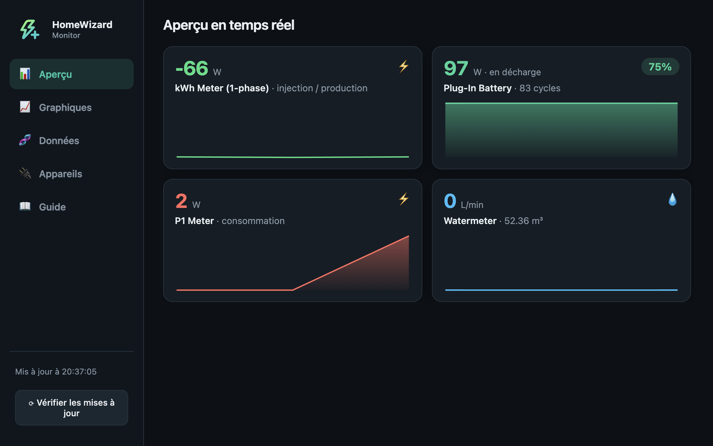
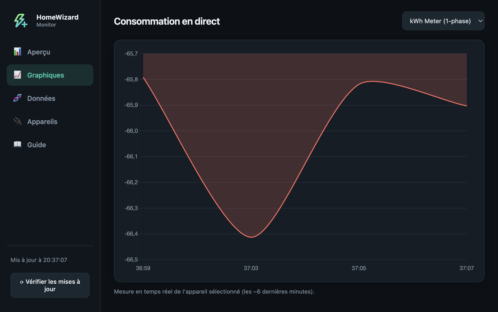
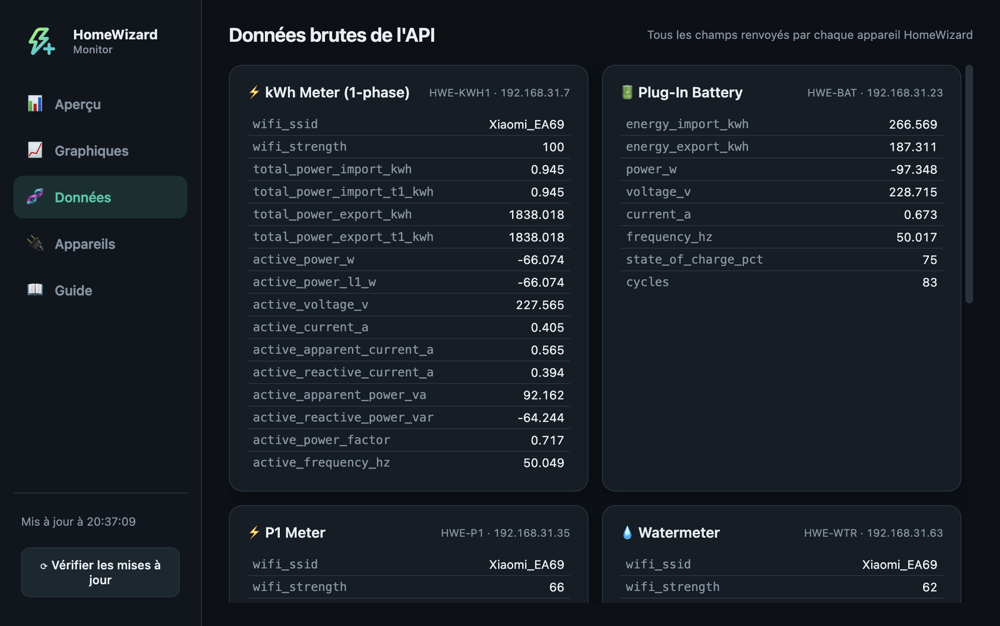

# HomeWizard Monitor

A lightweight **menu-bar / tray app + dashboard** for [HomeWizard Energy](https://www.homewizard.com/)
devices, on **Windows and macOS**. Glance at your live power from the menu bar (like a weather widget),
click for a full dashboard with real-time values and live charts — **100% local, no cloud account
required**. Includes a built-in **onboarding guide** so non-technical users can set it up alone.

> Available in **English, French and Dutch** — auto-detected and switchable in the app.



<p align="center">
  
  
</p>

---

## ✨ Features

- **Menu-bar / tray icon** — hover for a live tooltip of every device; click to open the dashboard.
  On macOS the icon is a system-style template glyph and can show a live value (e.g. battery %).
- **Real-time dashboard** — HomeWizard-style cards: big value + live area sparkline, with battery
  **state of charge %**, charge/discharge power, grid, solar, water flow, gas.
- **Live charts** — instant consumption per device (the local API keeps no history, so historical
  charts were intentionally dropped to avoid gaps when the app is closed).
- **In-app onboarding Guide** — first-run tab with the exact steps & gotchas (enable Local API,
  the "disable pairing button" trap, pairing sequence, troubleshooting).
- **Raw data tab** — every field returned by each device's API, for diagnostics.
- **Configurable menu-bar indicator** — render a chosen value (e.g. battery %) on the icon; the
  available metrics are filtered per device type.
- **Multilingual** — English, French and Dutch (auto-detected from the system, switchable in the app);
  the widgets follow the chosen language too.
- **Built-in update check** — compares your version to the latest GitHub release and offers the download.
- **Auto-discovery** (mDNS + LAN subnet scan) **or** manual IP entry; **DHCP self-healing** by serial.
- **Start at login** (tray menu toggle), packaged installers (`.dmg` / `.exe`).
- **Desktop widgets** — a **Windows 11 Widget** (MSIX) and a native **macOS WidgetKit** widget
  (`widget-mac/`) showing live energy on the desktop / Notification Center.
- No telemetry, no cloud calls — talks only to your devices on your LAN.

## 🔌 Supported devices

All HomeWizard Wi-Fi devices that expose the local API:

| Device | Product type | What you get |
| --- | --- | --- |
| P1 Meter | `HWE-P1` | Grid import/export, live power, gas & water (if linked to the meter) |
| Energy Socket | `HWE-SKT` | Power, import/export, on/off state |
| kWh Meter (1-phase) | `HWE-KWH1`, `HWE-KWHA`, `SDM230-wifi` | Power & energy (e.g. solar production) |
| kWh Meter (3-phase) | `HWE-KWH3`, `HWE-KWHB`, `SDM630-wifi` | Power & energy |
| Watermeter | `HWE-WTR` | Total m³ and live flow (battery-powered: reports intermittently) |
| Plug-In Battery | `HWE-BAT` | **State of charge %**, charge/discharge power, cycles (API v2 — enable its Local API + pairing) |

> **Pairing a battery / recent kWh meter (API v2):** enable **Local API** for that device in the
> HomeWizard phone app, and turn **off** *"Disable pairing button"*. Then click **Pair** in the
> Devices tab and press the device's physical button within 30 s. See the in-app **Guide** tab.

> No separate solar meter? Solar still shows up as **grid export** on the P1 card.

## 🧠 How it works

- Polls each device's **local API** every ~2 s:
  - v1 (HTTP, no auth): `GET /api/v1/data` for P1, sockets, kWh meters, watermeter.
  - v2 (HTTPS + Bearer token): `GET /api/measurement` for the Plug-In Battery.
- The local API has **no history**, so "today" / "this month" are computed as the difference between
  each cumulative counter and its value at the start of the period. History therefore builds up from the
  moment you install the app.
- All data is stored locally as JSON under Electron's `userData` folder
  (`%APPDATA%/HomeWizard Monitor/data/` on Windows, `~/Library/Application Support/homewizard-monitor/data/`
  on macOS). Nothing is uploaded anywhere.

## ✅ Requirements

- **Windows 10/11** or **macOS 12+** (Apple Silicon; the published `.dmg` is arm64).
- The computer must be on the **same network** as the HomeWizard devices, and the **Local API** must be
  enabled in the HomeWizard mobile app (per device: *Settings → Meter / Device → Local API*).
- [Node.js](https://nodejs.org/) 20+ only if you run from source or build.

## 📥 Download & install

Grab the latest installer from the [**Releases**](https://github.com/jeasonpourcelet/homewizard-monitor/releases) page:

- **Windows** — `HomeWizard Monitor Setup <version>.exe` (installer) or `HomeWizard-Monitor-portable.exe`
  (no install). The apps are unsigned, so SmartScreen may warn → *More info → Run anyway*.
- **macOS** (Apple Silicon) — `HomeWizard Monitor-<version>-arm64.dmg`: open it, drag the app into
  **Applications**. Unsigned, so at first launch **right-click → Open** (or *System Settings → Privacy &
  Security → Open anyway*).

## 🚀 Run from source

```bash
git clone https://github.com/jeasonpourcelet/homewizard-monitor.git
cd homewizard-monitor
npm install
npm run icons   # generate tray + app icons
npm start
```

## 📦 Build installers

```bash
npm run build       # Windows: dist/HomeWizard-Monitor-portable.exe + NSIS installer
npm run build:mac   # macOS:  dist/HomeWizard Monitor-<version>-arm64.dmg
```

Each platform is built on its own OS. Cross-building Windows from macOS needs Wine and is unreliable on
Apple Silicon — releases are produced by the GitHub Actions workflow (`.github/workflows/release.yml`),
which builds both on a tag push. To sign the macOS build with your own Apple Development certificate
(so the one-time data-access prompt persists), set `CSC_NAME="Apple Development: …"` before `build:mac`.

## ⚙️ First-time setup

1. Open the dashboard (tray icon) → **⚙**.
2. **Discover on the network**, or add a device **by IP**.
3. Tick the devices → **Save**.

**Pairing a battery (API v2):** tick it, click **🔗 Pair**, then press the physical button on the battery
within 30 s — the app stores the token.

## 🌐 Network notes

- **mDNS discovery doesn't cross routers/subnets.** If your HomeWizard devices sit behind a secondary
  router (their own subnet), put that router in **access-point/bridge mode**, or give the PC a foothold on
  that network (Wi-Fi/cable), then add devices **by IP**.
- On busy/weak 2.4 GHz, a flood scan loses packets — discovery and the built-in rediscovery scan gently in
  batches.
- Set a **DHCP reservation** for each device on your router so IPs stay stable. If an IP does change, the
  app re-finds the device by serial automatically.

## 🔒 Privacy

- **Local-only.** The app communicates solely with your devices over your LAN. No accounts, no cloud, no
  analytics.
- Your device IPs, serial numbers and battery tokens are stored **only** on your machine under `userData`
  and are **not** part of this repository.

## 🗺️ Roadmap

- [x] All HomeWizard local-API device types
- [x] Battery (v2 + pairing), water, gas
- [x] DHCP self-healing by serial
- [x] `.exe` + `.dmg` packaging, start-at-login, CI release (Windows + macOS)
- [x] macOS support (menu-bar app + native WidgetKit desktop widget)
- [x] In-app update check (GitHub releases)
- [ ] Aggregated "home" view (net = grid + solar ± battery)
- [ ] Configurable poll interval & per-device labels in the UI
- [ ] English / i18n

## 🤝 Contributing

Issues and PRs welcome — especially additional device fields, i18n, and macOS/Linux packaging.

## 📄 License

[MIT](LICENSE).

## ⚠️ Disclaimer

Not affiliated with or endorsed by HomeWizard. Uses the publicly documented
[local API](https://api-documentation.homewizard.com/). "HomeWizard" is a trademark of its respective owner.
